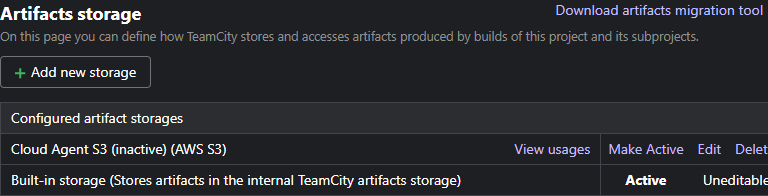
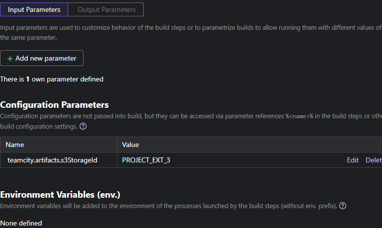
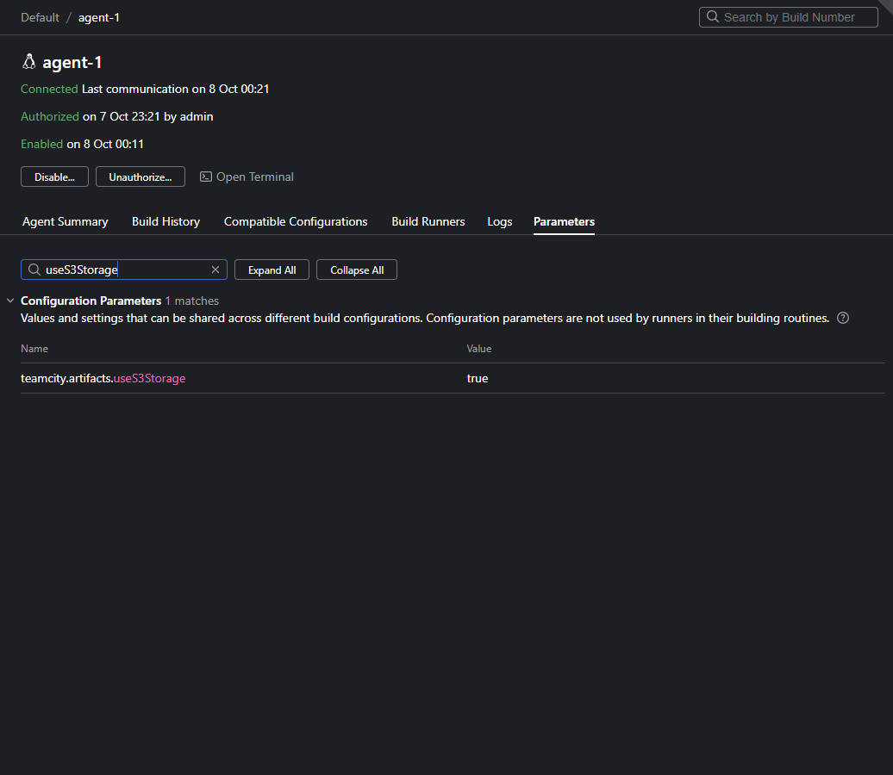
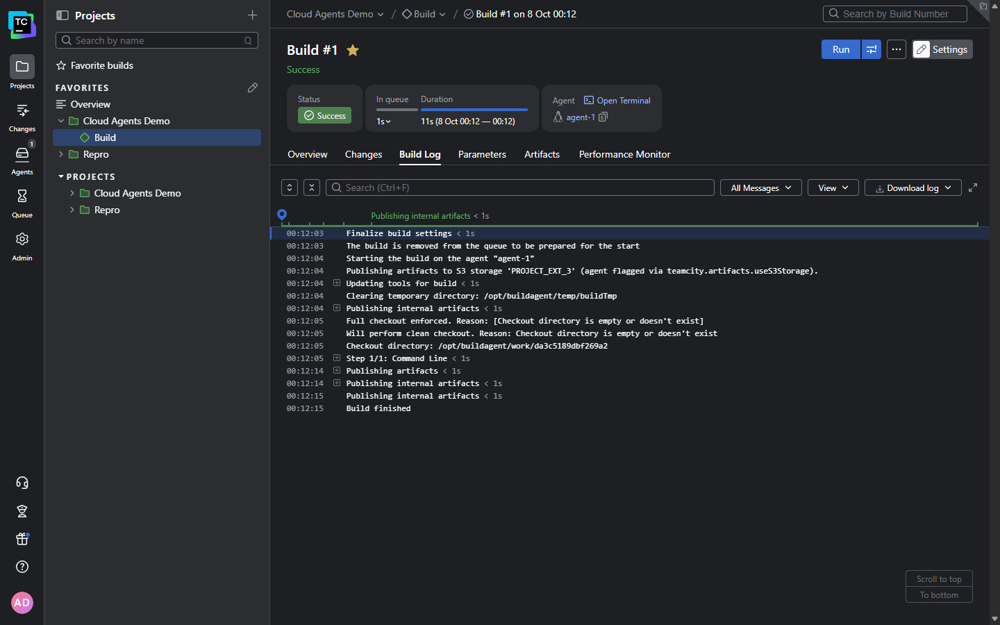

# S3 Artifacts Storage Selector

**Send artifacts to S3 for builds that run on specific agents — without changing any project's default storage.**

This TeamCity server plugin lets you keep the built-in server storage as the default for a project, while a chosen set of agents transparently publish their artifacts to a pre-configured S3 storage instead. The decision is made per build, on the server, at build start, based on the agent the build was assigned to. Nothing runs on the agent and no project default is modified.

Use it when only some of your agents should offload artifacts to S3 — for example cloud or ephemeral agents whose local disk is throwaway — while the rest keep using the built-in TeamCity storage.

For each starting build, the plugin:

- Checks whether the build's project already resolves to an active artifacts storage (its own or inherited); if so, it leaves that choice untouched
- Reads a configuration parameter on the assigned agent to decide whether that agent should use S3
- Looks up the target S3 storage id from a project parameter and validates that it resolves for the build's project
- Redirects the build's artifact publishing to that storage by setting the shared build parameter and the promotion's storage-reference attribute
- Falls back safely to the built-in storage, with a warning, if the configured storage id does not resolve
- Records what it did in both the build log and `teamcity-server.log`

## TeamCity compatibility

> [!IMPORTANT]
> The plugin uses artifact-storage server APIs available since TeamCity **2017.1**. It is built against the **2026.2** server API and has been verified end-to-end on TeamCity **2026.2.1**.

## Contents

### User guide

- [Quickstart](#quickstart)
- [How it works](#how-it-works)
- [Limitations](#limitations)

### Technical details

- [How the storage is selected](#how-the-storage-is-selected)
- [Logging](#logging)
- [Build](#build)
- [Install](#install)
- [Verification](#verification)

## Quickstart

An administrator installs the plugin and defines the S3 storage once. After that, choosing which agents use S3 is a one-line change to each agent's configuration.

### 1. Define the S3 storage and leave it inactive

In the project (or a shared parent project), open **Project Settings > Artifacts Storage**, add your S3 storage, and **do not activate it**. The built-in storage stays active, so normal builds are unaffected. Note the storage's **feature id** (for example `PROJECT_EXT_3`).



> [!IMPORTANT]
> The S3 storage must exist but stay **inactive**, and no ancestor project may have an active storage. If any active storage resolves for the project, the plugin leaves the build alone — it only ever acts on builds that would otherwise use the built-in server storage.

### 2. Point the project at the storage

In the same project, open **Parameters** and add a configuration parameter `teamcity.artifacts.s3StorageId` whose value is the storage feature id from step 1.



### 3. Flag the agents that should use S3

On each agent that should publish to S3, add this line to `conf/buildAgent.properties` and restart the agent:

```properties
teamcity.artifacts.useS3Storage=true
```

Use a plain configuration parameter (no `env.` or `system.` prefix) so it stays agent metadata and never leaks into build processes. For cloud agents, bake it into the image. The agent then reports the parameter to the server:



### 4. Run a build and confirm

Run a build of any configuration in the project on a flagged agent. The build log shows the plugin's selection line, and artifacts for that build are published to the S3 storage:



A build on an **unflagged** agent (or with the flag set to `false`) keeps the built-in storage and shows no such line.

## How it works

The S3 storage is defined once but left inactive, so it is never the project's "effective" storage and normal builds ignore it. The plugin is a server-side `BuildStartContextProcessor`: when a build starts, it inspects the assigned agent and, only for flagged agents on projects that are otherwise using the built-in storage, attaches the inactive S3 storage to that single build's promotion. The project default is never changed, and the feature is purely additive — it can only redirect builds that would otherwise land on the built-in server storage.

## How the storage is selected

For each starting build, in order:

1. **Explicit storage wins.** If the build's project resolves to an active artifacts storage — its own or inherited from an ancestor — the plugin does nothing. `ArtifactsStorageSettingsManager.findEffectiveSettings` returning `null` (built-in server storage) is the only case it acts on.
2. **Agent flag.** The assigned agent must report `teamcity.artifacts.useS3Storage=true`. Absent or any non-`true` value is treated as `false`.
3. **Target storage id.** The project parameter `teamcity.artifacts.s3StorageId` must be set. If it is missing, the build keeps the built-in storage (no warning — not every flagged project must use S3).
4. **Validation.** The id must resolve for the build's project hierarchy (`findSettingsWithSource`). If it does not, the plugin fails safe to the built-in storage and logs a warning.

When all conditions hold, the plugin:

- adds the shared build parameter keyed `ArtifactStorageSettings.STORAGE_FEATURE_ID` (read by the agent-side artifact publisher),
- sets the promotion attribute `BuildAttributes.STORAGE_SETTINGS_REFERENCE` (the server-side storage reference; it is defined as the same key as `STORAGE_FEATURE_ID`), and
- persists the promotion.

| Effective project storage | Agent flag | `s3StorageId` param | Resolves? | Result |
| -- | -- | -- | -- | -- |
| active (own or inherited) | — | — | — | no-op (explicit storage wins) |
| built-in | absent / `false` | — | — | no-op (built-in) |
| built-in | `true` | absent | — | no-op, no warning |
| built-in | `true` | set | no | no-op, **warning** |
| built-in | `true` | set | yes | redirected to S3 |

## Logging

- **Build log** — on selection, an informational line naming the storage id (shown in the screenshot above).
- **`teamcity-server.log`** — a matching `INFO` line on selection, and a `WARN` line when a configured storage id does not resolve. The plugin logs under the `jetbrains.buildServer.s3selector.*` category so both levels reach the server log file.

## Build

Requires a JDK 17+ and network access to the TeamCity Maven repository.

```bash
./gradlew build          # compiles, runs unit tests, produces the plugin zip
./gradlew serverPlugin   # just the zip, in build/distributions/
```

- The target API is set by `teamcityVersion` in `gradle.properties` (default `2026.2`). The public repository publishes `server-api` per *minor* release, so there is no `2026.2.1` coordinate — `2026.2` is API-compatible with the `2026.2.1` runtime.
- The processor uses classes from TeamCity's server implementation (`ArtifactsStorageSettingsManager`, `BuildPromotionEx`, `BuildAttributes`, `ArtifactStorageSettings`, `BuildLog`, `MessageAttrs`). These come from the `org.jetbrains.teamcity.internal:server` artifact, added on the `provided` classpath in `build.gradle.kts` (present on the running server at runtime, so not bundled in the plugin zip).

## Install

1. Build the plugin zip (`./gradlew serverPlugin`) or download a release.
2. In TeamCity, go to **Administration > Plugins > Upload plugin zip**, or drop the zip into the server data directory's `plugins/` folder.
3. Restart the TeamCity server and confirm `s3-storage-selector` appears in the loaded-plugins list.

## Verification

- Unit tests (`./gradlew test`) cover the full decision table plus the no-build-type guard.
- The behavior has been verified end-to-end on TeamCity 2026.2.1: a flagged agent redirects to the inactive S3 storage (build log + server log + the storage reference delivered to the agent), an unflagged agent keeps the built-in storage, and a bogus storage id fails safe with a server-log warning.

## Limitations

- **Server-side only.** The decision is made on the server at build start, based on the agent the build was assigned to. There is no agent-side component.
- **Additive only.** An explicitly selected active project storage (own or inherited) always wins; the plugin only redirects builds that would otherwise use the built-in server storage.
- **The agent flag is static.** It lives in `buildAgent.properties` and changing it requires an agent restart or re-provision. This suits cloud agents, where the flag is baked into the image.
- **The plugin selects, it does not configure.** It only points a build at an existing, admin-configured storage by id. It does not create the storage or validate its S3 credentials; if the storage itself is misconfigured, artifact publishing follows TeamCity's normal S3 path and its error handling.
- **The flag is read from configuration parameters.** `env.`- or `system.`-prefixed variants are not consulted.
